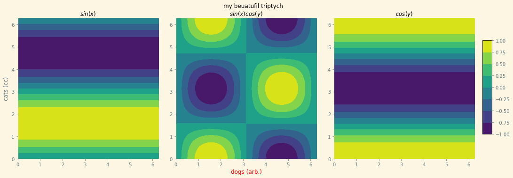

## <a id="McUtils.Plots.Graphics.GraphicsGrid">GraphicsGrid</a> 

<div class="docs-source-link" markdown="1">
[[source](https://github.com/McCoyGroup/McUtils/blob/master/McUtils/Plots/Graphics.py#L2481)/
[edit](https://github.com/McCoyGroup/McUtils/edit/master/McUtils/Plots/Graphics.py#L2481?message=Update%20Docs)]
</div>

A class for easily building sophisticated multi-panel figures.
Robustification work still needs to be done, but the core interface is there.
Supports themes & direct, easy access to the panels, among other things.
Builds off of `GraphicsBase`.


<div class="collapsible-section">
 <div class="collapsible-section collapsible-section-header" markdown="1">
## <a class="collapse-link" data-toggle="collapse" href="#methods" markdown="1"> Methods and Properties</a> <a class="float-right" data-toggle="collapse" href="#methods"><i class="fa fa-chevron-down"></i></a>
 </div>
 <div class="collapsible-section collapsible-section-body collapse " id="methods" markdown="1">
 ```python
default_style: dict
layout_keys: set
known_keys: set
GraphicsStack: GraphicsStack
```
<a id="McUtils.Plots.Graphics.GraphicsGrid.__init__" class="docs-object-method">&nbsp;</a> 
```python
__init__(self, *args, nrows=None, ncols=None, graphics_class=<class 'McUtils.Plots.Graphics.Graphics'>, figure=None, axes=None, subplot_kw=None, subimage_size=(310, 310), subimage_aspect_ratio='auto', padding=None, spacings=None, **opts): 
```
<div class="docs-source-link" markdown="1">
[[source](https://github.com/McCoyGroup/McUtils/blob/master/McUtils/Plots/Graphics.py#L2495)/
[edit](https://github.com/McCoyGroup/McUtils/edit/master/McUtils/Plots/Graphics.py#L2495?message=Update%20Docs)]
</div>
**LLM Docstring**

Build a multi-panel figure grid, inferring the shape from any supplied graphics,
sizing the figure from the sub-image size/padding/spacings, and populating the
panels.
  - `args`: `Any`
    > an optional nested list of graphics to place in the grid
  - `nrows`: `int | None`
    > the number of rows
  - `ncols`: `int | None`
    > the number of columns
  - `graphics_class`: `Any`
    > the class used for each panel
  - `figure`: `Any`
    > an existing figure to draw into
  - `axes`: `Any`
    > existing axes to draw into
  - `subplot_kw`: `dict | None`
    > subplot construction options
  - `subimage_size`: `Any`
    > the per-panel image size
  - `subimage_aspect_ratio`: `Any`
    > the per-panel aspect ratio
  - `padding`: `Any`
    > the grid padding
  - `spacings`: `Any`
    > the inter-panel spacings
  - `opts`: `Any`
    > extra options


<a id="McUtils.Plots.Graphics.GraphicsGrid.initialize_figure_and_axes" class="docs-object-method">&nbsp;</a> 
```python
initialize_figure_and_axes(self, figure, axes, *, nrows=None, ncols=None, graphics_class=None, fig_kw=None, subplot_kw=None, padding=None, spacings=None, subimage_size=None, subimage_aspect_ratio=None, **kw): 
```
<div class="docs-source-link" markdown="1">
[[source](https://github.com/McCoyGroup/McUtils/blob/master/McUtils/Plots/Graphics/GraphicsGrid.py#L2772)/
[edit](https://github.com/McCoyGroup/McUtils/edit/master/McUtils/Plots/Graphics/GraphicsGrid.py#L2772?message=Update%20Docs)]
</div>
Initializes the subplots for the Graphics object
  - `figure`: `Any`
    > 
  - `axes`: `Any`
    > 
  - `args`: `Any`
    > 
  - `kw`: `Any`
    > 
  - `:returns`: `GraphicsBackend.Figure, GraphicsBackend.Figure.Axes`
    > figure, axes


<a id="McUtils.Plots.Graphics.GraphicsGrid.set_options" class="docs-object-method">&nbsp;</a> 
```python
set_options(self, padding=None, spacings=None, background=None, colorbar=None, figure_label=None, **parent_opts): 
```
<div class="docs-source-link" markdown="1">
[[source](https://github.com/McCoyGroup/McUtils/blob/master/McUtils/Plots/Graphics/GraphicsGrid.py#L2866)/
[edit](https://github.com/McCoyGroup/McUtils/edit/master/McUtils/Plots/Graphics/GraphicsGrid.py#L2866?message=Update%20Docs)]
</div>
**LLM Docstring**

Set the grid-level options (figure label, padding, spacings, background,
colorbar) on top of the base options, recomputing the image size.
  - `padding`: `Any`
    > the grid padding
  - `spacings`: `Any`
    > the inter-panel spacings
  - `background`: `Any`
    > the background color
  - `colorbar`: `Any`
    > the colorbar spec
  - `figure_label`: `Any`
    > the overall figure label
  - `parent_opts`: `Any`
    > options forwarded to the base class


<a id="McUtils.Plots.Graphics.GraphicsGrid.__iter__" class="docs-object-method">&nbsp;</a> 
```python
__iter__(self): 
```
<div class="docs-source-link" markdown="1">
[[source](https://github.com/McCoyGroup/McUtils/blob/master/McUtils/Plots/Graphics/GraphicsGrid.py#L2903)/
[edit](https://github.com/McCoyGroup/McUtils/edit/master/McUtils/Plots/Graphics/GraphicsGrid.py#L2903?message=Update%20Docs)]
</div>
**LLM Docstring**

Iterate over the grid's panels.
  - `:returns`: `_`
    > the panel iterator


<a id="McUtils.Plots.Graphics.GraphicsGrid.__getitem__" class="docs-object-method">&nbsp;</a> 
```python
__getitem__(self, item): 
```
<div class="docs-source-link" markdown="1">
[[source](https://github.com/McCoyGroup/McUtils/blob/master/McUtils/Plots/Graphics/GraphicsGrid.py#L2912)/
[edit](https://github.com/McCoyGroup/McUtils/edit/master/McUtils/Plots/Graphics/GraphicsGrid.py#L2912?message=Update%20Docs)]
</div>
**LLM Docstring**

Get a panel by `(row, col)` (or a flat index).
  - `item`: `Any`
    > the index
  - `:returns`: `GraphicsBase`
    > the panel


<a id="McUtils.Plots.Graphics.GraphicsGrid.__setitem__" class="docs-object-method">&nbsp;</a> 
```python
__setitem__(self, item, val): 
```
<div class="docs-source-link" markdown="1">
[[source](https://github.com/McCoyGroup/McUtils/blob/master/McUtils/Plots/Graphics/GraphicsGrid.py#L2928)/
[edit](https://github.com/McCoyGroup/McUtils/edit/master/McUtils/Plots/Graphics/GraphicsGrid.py#L2928?message=Update%20Docs)]
</div>
**LLM Docstring**

Place a graphics object into a panel by `(row, col)` (or flat index), re-hosting
it onto the grid's figure.
  - `item`: `Any`
    > the index
  - `val`: `Any`
    > the graphics object (or raw value)


<a id="McUtils.Plots.Graphics.GraphicsGrid.set_image" class="docs-object-method">&nbsp;</a> 
```python
set_image(self, pos, val, **opts): 
```
<div class="docs-source-link" markdown="1">
[[source](https://github.com/McCoyGroup/McUtils/blob/master/McUtils/Plots/Graphics/GraphicsGrid.py#L2950)/
[edit](https://github.com/McCoyGroup/McUtils/edit/master/McUtils/Plots/Graphics/GraphicsGrid.py#L2950?message=Update%20Docs)]
</div>
**LLM Docstring**

Place a graphics object into the panel at `pos`, re-hosting it onto the grid's
figure with the given options.
  - `pos`: `Any`
    > the panel position
  - `val`: `GraphicsBase`
    > the graphics object
  - `opts`: `Any`
    > options forwarded to the re-hosting
  - `:returns`: `GraphicsBase`
    > the placed panel


<a id="McUtils.Plots.Graphics.GraphicsGrid.calc_image_size" class="docs-object-method">&nbsp;</a> 
```python
calc_image_size(self): 
```
<div class="docs-source-link" markdown="1">
[[source](https://github.com/McCoyGroup/McUtils/blob/master/McUtils/Plots/Graphics/GraphicsGrid.py#L2969)/
[edit](https://github.com/McCoyGroup/McUtils/edit/master/McUtils/Plots/Graphics/GraphicsGrid.py#L2969?message=Update%20Docs)]
</div>
**LLM Docstring**

Compute the grid's overall image size from the panels' sizes, the inter-panel
spacings, and the padding.
  - `:returns`: `tuple`
    > the `(width, height)` image size


<a id="McUtils.Plots.Graphics.GraphicsGrid.image_size" class="docs-object-method">&nbsp;</a> 
```python
@property
image_size(self): 
```
<div class="docs-source-link" markdown="1">
[[source](https://github.com/McCoyGroup/McUtils/blob/master/McUtils/Plots/Graphics/GraphicsGrid.py#L3005)/
[edit](https://github.com/McCoyGroup/McUtils/edit/master/McUtils/Plots/Graphics/GraphicsGrid.py#L3005?message=Update%20Docs)]
</div>
**LLM Docstring**

The grid's overall image size (recomputed from the panels on access).
  - `:returns`: `tuple`
    > the `(width, height)` image size


<a id="McUtils.Plots.Graphics.GraphicsGrid.figure_label" class="docs-object-method">&nbsp;</a> 
```python
@property
figure_label(self): 
```
<div class="docs-source-link" markdown="1">
[[source](https://github.com/McCoyGroup/McUtils/blob/master/McUtils/Plots/Graphics/GraphicsGrid.py#L3031)/
[edit](https://github.com/McCoyGroup/McUtils/edit/master/McUtils/Plots/Graphics/GraphicsGrid.py#L3031?message=Update%20Docs)]
</div>
**LLM Docstring**

The overall figure label. Getter/setter delegate to the property manager (the setter also records
the change for copying).
  - `:returns`: `_`
    > the figure label value


<a id="McUtils.Plots.Graphics.GraphicsGrid.padding" class="docs-object-method">&nbsp;</a> 
```python
@property
padding(self): 
```
<div class="docs-source-link" markdown="1">
[[source](https://github.com/McCoyGroup/McUtils/blob/master/McUtils/Plots/Graphics/GraphicsGrid.py#L3053)/
[edit](https://github.com/McCoyGroup/McUtils/edit/master/McUtils/Plots/Graphics/GraphicsGrid.py#L3053?message=Update%20Docs)]
</div>
**LLM Docstring**

The grid's outer padding. Getter/setter delegate to the property manager (the setter also records
the change for copying).
  - `:returns`: `_`
    > the padding value


<a id="McUtils.Plots.Graphics.GraphicsGrid.padding_left" class="docs-object-method">&nbsp;</a> 
```python
@property
padding_left(self): 
```
<div class="docs-source-link" markdown="1">
[[source](https://github.com/McCoyGroup/McUtils/blob/master/McUtils/Plots/Graphics/GraphicsGrid.py#L3075)/
[edit](https://github.com/McCoyGroup/McUtils/edit/master/McUtils/Plots/Graphics/GraphicsGrid.py#L3075?message=Update%20Docs)]
</div>
**LLM Docstring**

The grid's left padding. Getter/setter delegate to the property manager (the setter also records
the change for copying).
  - `:returns`: `_`
    > the left padding value


<a id="McUtils.Plots.Graphics.GraphicsGrid.padding_right" class="docs-object-method">&nbsp;</a> 
```python
@property
padding_right(self): 
```
<div class="docs-source-link" markdown="1">
[[source](https://github.com/McCoyGroup/McUtils/blob/master/McUtils/Plots/Graphics/GraphicsGrid.py#L3097)/
[edit](https://github.com/McCoyGroup/McUtils/edit/master/McUtils/Plots/Graphics/GraphicsGrid.py#L3097?message=Update%20Docs)]
</div>
**LLM Docstring**

The grid's right padding. Getter/setter delegate to the property manager (the setter also records
the change for copying).
  - `:returns`: `_`
    > the right padding value


<a id="McUtils.Plots.Graphics.GraphicsGrid.padding_top" class="docs-object-method">&nbsp;</a> 
```python
@property
padding_top(self): 
```
<div class="docs-source-link" markdown="1">
[[source](https://github.com/McCoyGroup/McUtils/blob/master/McUtils/Plots/Graphics/GraphicsGrid.py#L3119)/
[edit](https://github.com/McCoyGroup/McUtils/edit/master/McUtils/Plots/Graphics/GraphicsGrid.py#L3119?message=Update%20Docs)]
</div>
**LLM Docstring**

The grid's top padding. Getter/setter delegate to the property manager (the setter also records
the change for copying).
  - `:returns`: `_`
    > the top padding value


<a id="McUtils.Plots.Graphics.GraphicsGrid.padding_bottom" class="docs-object-method">&nbsp;</a> 
```python
@property
padding_bottom(self): 
```
<div class="docs-source-link" markdown="1">
[[source](https://github.com/McCoyGroup/McUtils/blob/master/McUtils/Plots/Graphics/GraphicsGrid.py#L3141)/
[edit](https://github.com/McCoyGroup/McUtils/edit/master/McUtils/Plots/Graphics/GraphicsGrid.py#L3141?message=Update%20Docs)]
</div>
**LLM Docstring**

The grid's bottom padding. Getter/setter delegate to the property manager (the setter also records
the change for copying).
  - `:returns`: `_`
    > the bottom padding value


<a id="McUtils.Plots.Graphics.GraphicsGrid.spacings" class="docs-object-method">&nbsp;</a> 
```python
@property
spacings(self): 
```
<div class="docs-source-link" markdown="1">
[[source](https://github.com/McCoyGroup/McUtils/blob/master/McUtils/Plots/Graphics/GraphicsGrid.py#L3164)/
[edit](https://github.com/McCoyGroup/McUtils/edit/master/McUtils/Plots/Graphics/GraphicsGrid.py#L3164?message=Update%20Docs)]
</div>
**LLM Docstring**

The inter-panel spacings. Getter/setter delegate to the property manager (the setter also records
the change for copying).
  - `:returns`: `_`
    > the spacings value


<a id="McUtils.Plots.Graphics.GraphicsGrid.background" class="docs-object-method">&nbsp;</a> 
```python
@property
background(self): 
```
<div class="docs-source-link" markdown="1">
[[source](https://github.com/McCoyGroup/McUtils/blob/master/McUtils/Plots/Graphics/GraphicsGrid.py#L3187)/
[edit](https://github.com/McCoyGroup/McUtils/edit/master/McUtils/Plots/Graphics/GraphicsGrid.py#L3187?message=Update%20Docs)]
</div>
**LLM Docstring**

The grid background color. Getter/setter delegate to the property manager (the setter also records
the change for copying).
  - `:returns`: `_`
    > the background value


<a id="McUtils.Plots.Graphics.GraphicsGrid.colorbar" class="docs-object-method">&nbsp;</a> 
```python
@property
colorbar(self): 
```
<div class="docs-source-link" markdown="1">
[[source](https://github.com/McCoyGroup/McUtils/blob/master/McUtils/Plots/Graphics/GraphicsGrid.py#L3210)/
[edit](https://github.com/McCoyGroup/McUtils/edit/master/McUtils/Plots/Graphics/GraphicsGrid.py#L3210?message=Update%20Docs)]
</div>
**LLM Docstring**

The grid colorbar specification. Getter/setter delegate to the property manager (the setter also records
the change for copying).
  - `:returns`: `_`
    > the colorbar value
 </div>
</div>


## Examples
Create a multi-panel figure

<div class="card in-out-block" markdown="1">

```python
grid = np.linspace(0, 2 * np.pi, 100)
grid_2D = np.meshgrid(grid, grid)
x = grid_2D[1]
y = grid_2D[0]

main = GraphicsGrid(ncols=3, nrows=1, theme='Solarize_Light2', figure_label='my beuatufil triptych',
                            padding=((35, 60), (35, 40)), subimage_size=300)
main[0, 0] = ContourPlot(x, y, np.sin(y), plot_label='$sin(x)$',
                         axes_labels=[None, "cats (cc)"],
                         figure=main[0, 0]
                         )
main[0, 1] = ContourPlot(x, y, np.sin(x) * np.cos(y),
                         plot_label='$sin(x)cos(y)$',
                         axes_labels=[Styled("dogs (arb.)", {'color': 'red'}), None],
                         figure=main[0, 1])
main[0, 2] = ContourPlot(x, y, np.cos(y), plot_label='$cos(y)$', figure=main[0, 2])
main.colorbar = {"graphics": main[0, 1].graphics}
```

<div class="card-body out-block" markdown="1">


</div>
</div>


---


<div markdown="1" class="text-secondary">
<div class="container">
  <div class="row">
   <div class="col" markdown="1">
**Feedback**   
</div>
   <div class="col" markdown="1">
**Examples**   
</div>
   <div class="col" markdown="1">
**Templates**   
</div>
   <div class="col" markdown="1">
**Documentation**   
</div>
   <div class="col" markdown="1">
   
</div>
   <div class="col" markdown="1">
   
</div>
   <div class="col" markdown="1">
   
</div>
</div>
  <div class="row">
   <div class="col" markdown="1">
[Bug](https://github.com/McCoyGroup/McUtils/issues/new?title=Documentation%20Improvement%20Needed)/[Request](https://github.com/McCoyGroup/McUtils/issues/new?title=Example%20Request)   
</div>
   <div class="col" markdown="1">
[Edit](https://github.com/McCoyGroup/McUtils/edit/gh-pages/ci/examples/McUtils/Plots/Graphics/GraphicsGrid.md)/[New](https://github.com/McCoyGroup/McUtils/new/gh-pages/?filename=ci/examples/McUtils/Plots/Graphics/GraphicsGrid.md)   
</div>
   <div class="col" markdown="1">
[Edit](https://github.com/McCoyGroup/McUtils/edit/gh-pages/ci/docs/McUtils/Plots/Graphics/GraphicsGrid.md)/[New](https://github.com/McCoyGroup/McUtils/new/gh-pages/?filename=ci/docs/templates/McUtils/Plots/Graphics/GraphicsGrid.md)   
</div>
   <div class="col" markdown="1">
[Edit](https://github.com/McCoyGroup/McUtils/edit/master/McUtils/Plots/Graphics.py#L2481?message=Update%20Docs)   
</div>
   <div class="col" markdown="1">
   
</div>
   <div class="col" markdown="1">
   
</div>
   <div class="col" markdown="1">
   
</div>
</div>
</div>
</div>