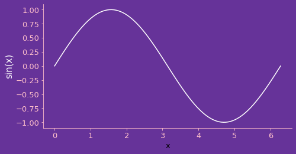
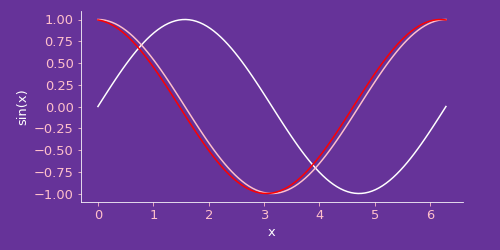
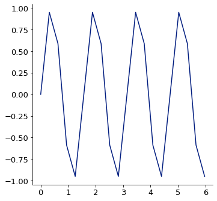

## <a id="McUtils.Plots.Plots.Plot">Plot</a> 

<div class="docs-source-link" markdown="1">
[[source](https://github.com/McCoyGroup/McUtils/blob/master/Plots/Plots.py#L171)/
[edit](https://github.com/McCoyGroup/McUtils/edit/master/Plots/Plots.py#L171?message=Update%20Docs)]
</div>

The base plotting class to interface into matplotlib or (someday 3D) VTK.
In the future hopefully we'll be able to make a general-purpose `PlottingBackend` class that doesn't need to be `matplotlib` .
Builds off of the `Graphics` class to make a unified and convenient interface to generating plots.
Some sophisticated legwork unfortunately has to be done vis-a-vis tracking constructed lines and other plotting artefacts,
since `matplotlib` is designed to infuriate.


<div class="collapsible-section">
 <div class="collapsible-section collapsible-section-header" markdown="1">
## <a class="collapse-link" data-toggle="collapse" href="#methods" markdown="1"> Methods and Properties</a> <a class="float-right" data-toggle="collapse" href="#methods"><i class="fa fa-chevron-down"></i></a>
 </div>
 <div class="collapsible-section collapsible-section-body collapse " id="methods" markdown="1">
 ```python
line_params: set
patch_parms: set
opt_keys: set
default_plot_style: dict
style_mapping: dict
known_styles: set
method: str
known_keys: set
plot_classes: dict
```
<a id="McUtils.Plots.Plots.Plot.__init__" class="docs-object-method">&nbsp;</a> 
```python
__init__(self, *params, method=None, figure=None, axes=None, subplot_kw=None, plot_style=None, theme=None, **opts): 
```
<div class="docs-source-link" markdown="1">
[[source](https://github.com/McCoyGroup/McUtils/blob/master/Plots/Plots/Plot.py#L202)/
[edit](https://github.com/McCoyGroup/McUtils/edit/master/Plots/Plots/Plot.py#L202?message=Update%20Docs)]
</div>

  - `params`: `Any`
    > _empty_ or _x_, _y_ arrays or _function_, _xrange_
  - `plot_style`: `dict | None`
    > the plot styling options to be fed into the plot method
  - `method`: `str | function`
    > the method name as a string or functional form of the method to plot
  - `figure`: `Graphics | None`
    > the Graphics object on which to plot (None means make a new one)
  - `axes`: `None`
    > the axes on which to plot (used in constructing a Graphics, None means make a new one)
  - `subplot_kw`: `dict | None`
    > the keywords to pass on when initializing the plot
  - `colorbar`: `None | bool | dict`
    > whether to use a colorbar or what options to pass to the colorbar
  - `opts`: `Any`
    > options to be fed in when initializing the Graphics


<a id="McUtils.Plots.Plots.Plot.filter_options" class="docs-object-method">&nbsp;</a> 
```python
@classmethod
filter_options(cls, opts, allowed=None): 
```
<div class="docs-source-link" markdown="1">
[[source](https://github.com/McCoyGroup/McUtils/blob/master/__init__.py#L266)/
[edit](https://github.com/McCoyGroup/McUtils/edit/master/__init__.py#L266?message=Update%20Docs)]
</div>


<a id="McUtils.Plots.Plots.Plot.plot" class="docs-object-method">&nbsp;</a> 
```python
plot(self, *params, insert_default_styles=True, **plot_style): 
```
<div class="docs-source-link" markdown="1">
[[source](https://github.com/McCoyGroup/McUtils/blob/master/Plots/Plots/Plot.py#L292)/
[edit](https://github.com/McCoyGroup/McUtils/edit/master/Plots/Plots/Plot.py#L292?message=Update%20Docs)]
</div>
Plots a set of data & stores the result
  - `:returns`: `_`
    > t
h
e
 
g
r
a
p
h
i
c
s
 
t
h
a
t
 
m
a
t
p
l
o
t
l
i
b
 
m
a
d
e


<a id="McUtils.Plots.Plots.Plot.artists" class="docs-object-method">&nbsp;</a> 
```python
@property
artists(self): 
```
<div class="docs-source-link" markdown="1">
[[source](https://github.com/McCoyGroup/McUtils/blob/master/Plots/Plots/Plot.py#L305)/
[edit](https://github.com/McCoyGroup/McUtils/edit/master/Plots/Plots/Plot.py#L305?message=Update%20Docs)]
</div>


<a id="McUtils.Plots.Plots.Plot.clear" class="docs-object-method">&nbsp;</a> 
```python
clear(self): 
```
<div class="docs-source-link" markdown="1">
[[source](https://github.com/McCoyGroup/McUtils/blob/master/Plots/Plots/Plot.py#L325)/
[edit](https://github.com/McCoyGroup/McUtils/edit/master/Plots/Plots/Plot.py#L325?message=Update%20Docs)]
</div>
Removes the plotted data


<a id="McUtils.Plots.Plots.Plot.restyle" class="docs-object-method">&nbsp;</a> 
```python
restyle(self, **plot_style): 
```
<div class="docs-source-link" markdown="1">
[[source](https://github.com/McCoyGroup/McUtils/blob/master/Plots/Plots/Plot.py#L332)/
[edit](https://github.com/McCoyGroup/McUtils/edit/master/Plots/Plots/Plot.py#L332?message=Update%20Docs)]
</div>
Replots the data with updated plot styling
  - `plot_style`: `Any`
    >


<a id="McUtils.Plots.Plots.Plot.data" class="docs-object-method">&nbsp;</a> 
```python
@property
data(self): 
```
<div class="docs-source-link" markdown="1">
[[source](https://github.com/McCoyGroup/McUtils/blob/master/Plots/Plots/Plot.py#L341)/
[edit](https://github.com/McCoyGroup/McUtils/edit/master/Plots/Plots/Plot.py#L341?message=Update%20Docs)]
</div>
The data that we plotted


<a id="McUtils.Plots.Plots.Plot.plot_style" class="docs-object-method">&nbsp;</a> 
```python
@property
plot_style(self): 
```
<div class="docs-source-link" markdown="1">
[[source](https://github.com/McCoyGroup/McUtils/blob/master/Plots/Plots/Plot.py#L349)/
[edit](https://github.com/McCoyGroup/McUtils/edit/master/Plots/Plots/Plot.py#L349?message=Update%20Docs)]
</div>
The styling options applied to the plot


<a id="McUtils.Plots.Plots.Plot.add_colorbar" class="docs-object-method">&nbsp;</a> 
```python
add_colorbar(self, graphics=None, norm=None, **kw): 
```
<div class="docs-source-link" markdown="1">
[[source](https://github.com/McCoyGroup/McUtils/blob/master/Plots/Plots/Plot.py#L360)/
[edit](https://github.com/McCoyGroup/McUtils/edit/master/Plots/Plots/Plot.py#L360?message=Update%20Docs)]
</div>
Adds a colorbar to the plot


<a id="McUtils.Plots.Plots.Plot.set_graphics_properties" class="docs-object-method">&nbsp;</a> 
```python
set_graphics_properties(self, *which, **kw): 
```
<div class="docs-source-link" markdown="1">
[[source](https://github.com/McCoyGroup/McUtils/blob/master/Plots/Plots/Plot.py#L369)/
[edit](https://github.com/McCoyGroup/McUtils/edit/master/Plots/Plots/Plot.py#L369?message=Update%20Docs)]
</div>


<a id="McUtils.Plots.Plots.Plot.merge" class="docs-object-method">&nbsp;</a> 
```python
@classmethod
merge(cls, main, other, *rest, **kwargs): 
```
<div class="docs-source-link" markdown="1">
[[source](https://github.com/McCoyGroup/McUtils/blob/master/__init__.py#L379)/
[edit](https://github.com/McCoyGroup/McUtils/edit/master/__init__.py#L379?message=Update%20Docs)]
</div>


<a id="McUtils.Plots.Plots.Plot.resolve_method" class="docs-object-method">&nbsp;</a> 
```python
@classmethod
resolve_method(cls, mpl_name): 
```
<div class="docs-source-link" markdown="1">
[[source](https://github.com/McCoyGroup/McUtils/blob/master/__init__.py#L384)/
[edit](https://github.com/McCoyGroup/McUtils/edit/master/__init__.py#L384?message=Update%20Docs)]
</div>


<a id="McUtils.Plots.Plots.Plot.register" class="docs-object-method">&nbsp;</a> 
```python
@classmethod
register(cls, plot_class): 
```
<div class="docs-source-link" markdown="1">
[[source](https://github.com/McCoyGroup/McUtils/blob/master/__init__.py#L390)/
[edit](https://github.com/McCoyGroup/McUtils/edit/master/__init__.py#L390?message=Update%20Docs)]
</div>
 </div>
</div>


## Examples
Regular `matplotlib` plotting syntax works:

<div class="card in-out-block" markdown="1">

```python
import numpy as np
from McUtils.Plots import *

grid = np.linspace(0, 2*np.pi, 100)
plot = Plot(grid, np.sin(grid))
plot.show()
```
<div class="card-body out-block" markdown="1">


</div>
</div>

You can also set a background / axes labels / other options

<div class="card in-out-block" markdown="1">

```python
plot = Plot(grid, np.sin(grid),
        plot_style={'color':'white'},
        axes_labels = ['x', Styled("sin(x)", color='white', fontsize=15)],
        frame_style={'color':'pink'},
        ticks_style={'color':'pink', 'labelcolor':'pink'},
        background = "rebeccapurple",
        image_size=500,
        aspect_ratio=.5
        )
```
<div class="card-body out-block" markdown="1">


</div>
</div>

lots of styling can sometimes be easier to manage with the `theme` option, which uses matplotlib's `rcparams`:

<div class="card in-out-block" markdown="1">

```python
from cycler import cycler # installed with matplotlib

base_plot = Plot(grid, np.sin(grid),
        theme = ('mccoy', 
                 {
                     'figure.facecolor':'rebeccapurple',
                     'axes.facecolor':'rebeccapurple',
                     'axes.edgecolor':'white', 
                     'axes.prop_cycle': cycler(color=['white', 'pink', 'red']),
                     'axes.labelcolor':'white',
                     'xtick.color':'pink', 
                     'ytick.color':'pink'
                 }
                ),
        axes_labels = ['x', "sin(x)"],
        image_size=500,
        aspect_ratio=.5
        )
```
<div class="card-body out-block" markdown="1">


</div>
</div>

it's worth noting that these styles are "sticky" when updating the figure

<div class="card in-out-block" markdown="1">

```python
Plot(grid, np.cos(grid), figure=base_plot)
```
<div class="card-body out-block" markdown="1">


</div>

```python
Plot(grid, np.cos(.1+grid), figure=base_plot)
```

<div class="card-body out-block" markdown="1">


</div>
</div>


You can also plot a function over a given range

<div class="card in-out-block" markdown="1">

```python
Plot(lambda x: np.sin(4*x), [0, 2*np.pi])
```
<div class="card-body out-block" markdown="1">


</div>
</div>

and you can also specify the step size for sampling the plotting range

<div class="card in-out-block" markdown="1">

```python
Plot(lambda x: np.sin(4*x), [0, 2*np.pi, np.pi/10])
```
<div class="card-body out-block" markdown="1">


</div>
</div>


---


<div markdown="1" class="text-secondary">
<div class="container">
  <div class="row">
   <div class="col" markdown="1">
**Feedback**   
</div>
   <div class="col" markdown="1">
**Examples**   
</div>
   <div class="col" markdown="1">
**Templates**   
</div>
   <div class="col" markdown="1">
**Documentation**   
</div>
   <div class="col" markdown="1">
   
</div>
   <div class="col" markdown="1">
   
</div>
   <div class="col" markdown="1">
   
</div>
</div>
  <div class="row">
   <div class="col" markdown="1">
[Bug](https://github.com/McCoyGroup/McUtils/issues/new?title=Documentation%20Improvement%20Needed)/[Request](https://github.com/McCoyGroup/McUtils/issues/new?title=Example%20Request)   
</div>
   <div class="col" markdown="1">
[Edit](https://github.com/McCoyGroup/McUtils/edit/gh-pages/ci/examples/McUtils/Plots/Plots/Plot.md)/[New](https://github.com/McCoyGroup/McUtils/new/gh-pages/?filename=ci/examples/McUtils/Plots/Plots/Plot.md)   
</div>
   <div class="col" markdown="1">
[Edit](https://github.com/McCoyGroup/McUtils/edit/gh-pages/ci/docs/McUtils/Plots/Plots/Plot.md)/[New](https://github.com/McCoyGroup/McUtils/new/gh-pages/?filename=ci/docs/templates/McUtils/Plots/Plots/Plot.md)   
</div>
   <div class="col" markdown="1">
[Edit](https://github.com/McCoyGroup/McUtils/edit/master/Plots/Plots.py#L171?message=Update%20Docs)   
</div>
   <div class="col" markdown="1">
   
</div>
   <div class="col" markdown="1">
   
</div>
   <div class="col" markdown="1">
   
</div>
</div>
</div>
</div>